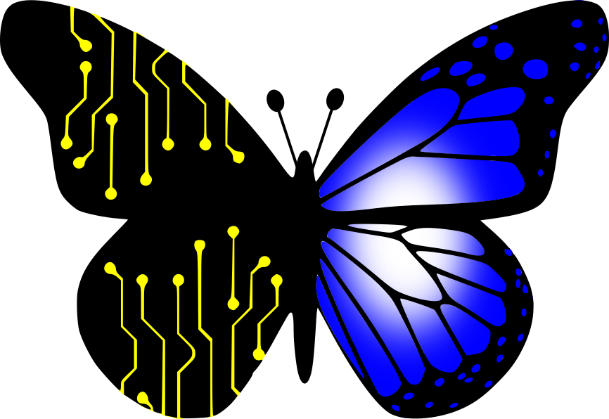

  
  <h1>Mujeres en Tecnología</h1>
  <b>La lista para visibilizar a más mujeres creadoras de contenido o que se destaquen en cualquier rubro de la tecnología.</b>

## C

[Carmen Ansio - Google Dev Expert • UX Engineer](https://recursoscosmicos.com/)

## E

[Estefany Aguilar - Friend of CSS • Sr. Frontend Dev & Educator • Speaker at  • Telecommunications Engineer](https://twitter.com/teffcode)

## L

[Lea Verou - Miembro de la W3C y con casi veinte años de experiencia en diseño y desarrollo web.](https://lea.verou.me/)

## M

[Miriam Gonzalez - Ingeniera software • Divulgadora de tecnología • Podcaster](https://miriamgonzalez.dev/)

[Maybemar Hernández - Ingeniera software • Divulgadora sobre tecnología • Educadora](https://maybemarhs.com/)

## N

[Núria Soriano - Front End Category Lead en Codely y amante de CSS, JavaScript y Vue.js](https://www.nuriasatorres.com/)

  <b>Si conoces a alguna mujer que admires en programación o algún tema relacionado con tecnología, no dudes en agregarla a esta lista.</b>

